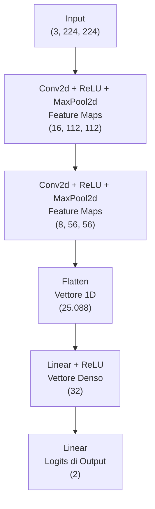
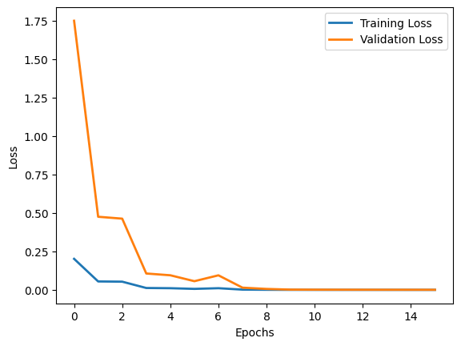
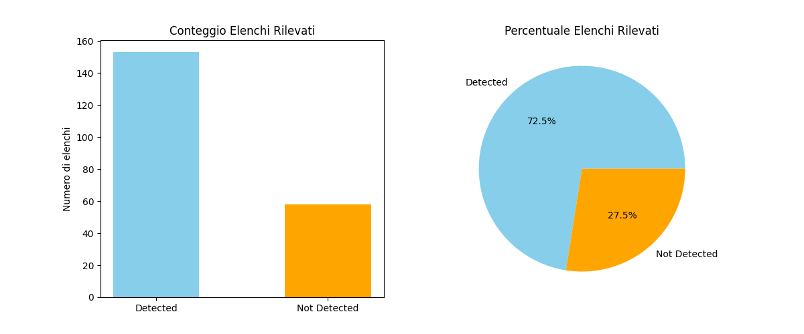

# Estrazione Dati delle Sdrogo Corse - All Time


Questa cartella spiega il processo utilizzato per estrarre i frame contenenti la classifica dai video YouTube delle *Sdrogo Corse* e la pipeline utilizzata per ottenere il dataset in formato *.csv* che popola il sito. Questo processo ha permesso di estrarre **144 elenchi** dai video caricati tra il 2015 e il 2026.

Il modello è stato addestrato per determinare se un determinato frame, in una determinata posizione all'interno del video, fosse considerato **leaderboard**, quindi un immagine della classifica, oppure **not leaderboard**.

## Struttura Cartella


```
├── dataset
│   ├── train
│   │   ├── leaderboard
│   │   └── not_leaderboard
│   └── val
│       ├── leaderboard
│       └── not_leaderboard
├── model
│   └── leaderboard_model.pth
├── processed
│   ├── detected.json
│   └── not_detected.json
├── cnn_detector.py
├── requirements.txt
└── torch_model.ipynb
```

- Nella cartella **dataset** sono presenti le immagini utilizzate per l'addestramento e la validazione del modello;
- La cartella **model** contiene il modello CNN utilizzato per l'individuazione della classifica;
- La cartella **processed** contiene i file .json con all'interno i metadati dei video con classifica individuata e non;
- `cnn_detector.py` è lo script per l'individuazione delle classifiche tramite video
- `torch_model.ipynb` è il notebook utilizzato per la creazione e l'allenamnento del modello


## Rete Neurale

L'estrazione si è svolta tramite la creazione e l'allenamento di una rete neurale convoluzionale (CNN) con 4 strati ponderati, di cui 2 convoluzionali e 2 lineari, addestrati per la classificazione di immagini.

Qui sotto lo schema della rete neurale creata in `torch_model.ipynb` con il numero di parametri ed i pesi presenti in ogni strato.  



### Training e Validazione 

Il dataset utilizzato per l'addestramento consiste in 154 immagini classificate come **leaderboard** e 254 immagini classificate come **not_leaderboard**. E' stato utilizzato un maggior numero di classificazioni negative per addestrare il modello ad avere il minor numero possibile di falsi positivi (immagine scaricata come contente classifica quando in realtà questa non è presente), in modo da evitare immagini non contenti la classifica all'interno del dataset nel corso della pipeline.

Il dataset invece utilizzato per la validazione è composto da 40 immagini in totale: 20 classificate come **leaderboard**, 20 come **not_leaderboard** 

La fase di addestramento si è ripetuta per 16 epoche, per poi procedere con la fase di validazione. I risultati sono riportati di seguito.

Il modello con i rispettivi pesi sono poi stati salvati per essere implementati nella pipeline di estrazione delle immagini



Il modello è disponibile nella cartella `model/leaderboard_model.pth` e il codice utilizzato per crearlo si trova in `torch_model.ipynb`

## 📊Estrazione Classifiche

Le immagini delle classifiche sono state estratte tramite l'utilizzo della CNN creata, l'API di YouTube per estrapolare i metadati dei video.

Il file `cnn_detector.py`, attraverso l'utilizzo di ffmpeg e la libreria cv2 analizza gli ultimi 150 secondi di video (dove solitamente viene mostrata la classifica finale) e estrapola questi frame per classificarli tramite il modello: una volta che viene individuata la classifica, uno screenshot del frame viene salvato.

I metadati del video vengono poi salvati in un file json per indicare che il video è stato analizzato.

### OCR - Estrazione Valori

Per l'estrazione della classifica da immagine a testo, diverse tecniche di OCR - Optical Character Recognition - sono state tentate in locale, ma nessuna ha prodotto risultati ottimali.

L'utilizzo di modelli AI locali (3B, 7B parametri) con capacità di lettura delle immagini sono stati utilizzati, ma anche questi hanno prodotto scarsi risultati.
Dei 211 video analizzati, 153 hanno estratto una classifica, mentre 58 non avevano una classifica mostrata in video o non sono stati individuati dal modello.
La lista dei video analizzati è divisa in detected.json e not_detected.json


Ho quindi utilizzato NotebookLM per l'estrazione e la creazione del dataset finale `sdrogo_corse_chronological.csv`. Non esclusi dunque errori nella lettura delle immagini e nell'estrazione del testo.


### Limitazioni

Questo metodo è stato utilizzato principalmente per una *bulk extraction*: estrarre il più alto numero di classifiche da più video possibili. Questa pipeline non è pensata per un'automazione completa di ogni video, ed andrebbe migliorata. Le ultime sdrogo corse, data anche la poca frequenza di caricamento, vengono estratte a mano e inserite nel file .csv.

Numerosi video, inoltre, non mostrano la classifica, oppure la mostrano solo parzialmente. In questo caso, il modello non riesce ad estrarre alcune classifiche, e numerosi video non vengono conteggiati

Inoltre, diversi falsi negativi sono presenti: il modello non riconosce alcuni elenchi, sebbene la classifica sia presente negli ultimi 150 secondi di video. 

## Riproducibilità

Segui questi passi per scaricare il modello ed estrarre le immagine delle classifiche inserendo il link di un video o di una playlist

1. Requisiti
    E' necessario aver installato sul proprio PC e aver inserito nel percorso ffmpeg, software per la gestione e manipolazione di video tramite linea di comando, Python o Python3, PyTorch.

    Puoi controllare l'installazione di ffmpeg e Python tramite questo codice:

    ```
    ffmpeg -version
    python -V
    ```

    L'installazione di PyTorch richiede invece la versione di Python installata e, se compatibile, la versione di CUDA per l'utilizzo della GPU. Maggiori dettaglie nel sito ufficiale [PyTorch](https://pytorch.org/).

2. Installazione pacchetti

    ```
    pip install -r requirements.txt
    ```

3. Esecuzione del Codice

    ```
    python cnn_detector.py
    ```

    Inserisci il link del video o della playlist.

## Mantenimento

Questo codice è stato scritto per aumentare il numero di elenchi all'interno del dataset, e il suo utilizzo per l'estrazione sporadica di singole gare non è ottimale.

In vista di un miglioramento futuro, il prossimo step sarebbe quello di automatizzare l'estrazione dell'immagine, migliorando il salvataggio dei metadati e standardizzandolo con quello della versione *golf with your friends*, e il riconscimento del testo, tramite chiamata API a un modello LLM di frontiera (Gemini, ChatGPT, etc) o con l'implementazione in locale di un OCR o di un LLM locale. 
